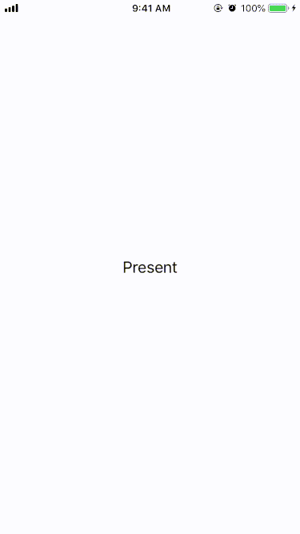

# SlidingCardViewController
SlidingCardViewController is a customizable view controller to present a animating and interactive sliding up front card view.

## Demo


## Installation

### CocoaPods
Add the following line into your app's pod file and run pod install:
```perl
pod 'SlidingCardViewController', :git => 'https://github.com/complex1ty/SlidingCardViewController.git'
```

## Usage

Simply use SlidingCardViewController(view: UIView) to construct a view controller with your UI view to present.
SlidingCardViewController can fit the height of input view.
```swift
let cardView = YourCardView()
let presentedCardViewController = SlidingCardViewController(cardView)
// customize with presentedCardViewController.property here...
present(presentedCardViewController, animated: true, completion: nil)
```

There are serveral customization options to set before presenting the view controller.

```swift
// animation duration
presentedCardViewController.property.transitionDuration = 0.5
// presentedCardView rounded corner
presentedCardViewController.property.fontViewCornerRadius = 10
// auto-dismiss when user drags down percentage * card view height
presentedCardViewController.property.autoDismissalInteractionPercentage = 0.5
// the opacity of the dim view in front of presenting view controller
presentedCardViewController.property.backViewDimOpacity = 0.2
// see more in SlidingCardProperty.swift...
```